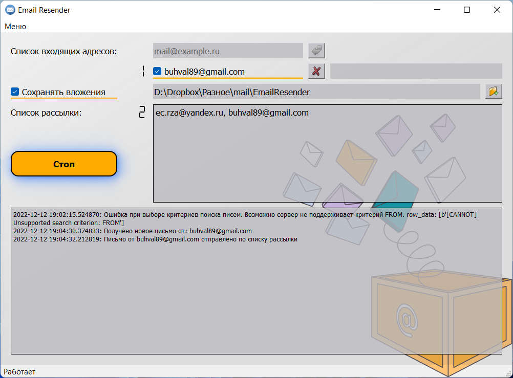
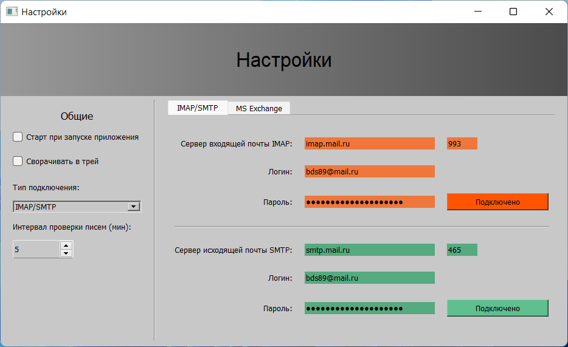

# E-mail Resender

Автоматическая переадресация писем.





## Описание
Программа получает письма с указанных ящиков, с указанной темой сообщения и рассылает их по списку рассылки.

- Фильтр тем сообщений допускает несколько ошибок (например "Отчт" и "отчет" - одно и тоже.
- Вложения можно сохранять в указанную папку, по умолчанию - папка запуска программы.
- Можно использовать раные ящики для получения и отправки писем.

**Поддерживаемые ОС**

- Linux
- Windows

**Установка**

  ```bash
  pip install git+https://github.com/bds89/email-resender
  ```
Если требуется создание ярлыков:
  ```bash
  email-resender_shortcut
  ```
Так-же под Windows есть готовый .exe пакет по адресу: [email-resender(exe)](https://github.com/bds89/email-resender-exe-)

Запуск возможен, либо с ярлыка, либо командой 
  ```bash
  email-resender
  ```
